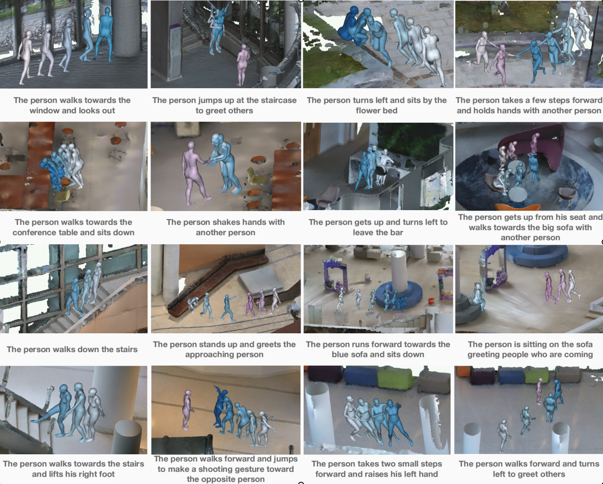

# LaserHuman: Language-guided Scene-aware Human Motion Generation in Free Environment.

<!-- ### [Project Page](https://4dvlab.github.io/project_page/laserhuman.html) | [Arxiv](https://arxiv.org/pdf/2403.13307.pdf) -->

<p align="center">
  <a href='https://arxiv.org/pdf/2403.13307.pdf'>
    </a>
  <a href='https://arxiv.org/pdf/2403.13307.pdf'>
    
  </a>
  <a href='https://4dvlab.github.io/project_page/laserhuman.html'>
  </a>
  <!-- <a href='https://youtu.be/0a0ZYJgzdWE'>
  </a> -->
  <!-- <a href="" target='_blank'>
    
  </a> -->
</p>
<p float="center">
  
</p>


Language-guided scene-aware human motion generation has great significance for entertainment and robotics. In response to the limitations of existing datasets, we introduce LaserHuman, which stands out with its inclusion of genuine human motions within 3D environments, unbounded free-form natural language descriptions, a blend of indoor and outdoor scenarios, and dynamic, ever-changing scenes. 
Diverse modalities of capture data and rich annotations present great opportunities for the research of Scene-Text-to-Motion generation, and can also facilitate the development of real-life applications.
Moreover, to generate semantically consistent and physically plausible human motions, we propose a multi-conditional diffusion model, which is simple but effective, achieving state-of-the-art performance on existing datasets. 


## 💻 Train your own models
1. Prepare the datasets
<p float="center">
  
</p>
We release sample of our dataset on  <a href='https://drive.google.com/drive/folders/1VwU57z4yrlgRgsAEHP2CzN_BPBz6eqIZ?usp=drive_link'>Google Drive</a>.

The annotation is saved in ```pub_datas.pkl``` for each motion sequence.

Please prepare the dataset as following folder struction:
```
./LaserHuman_path
  └── data/
      ├──process    # the dense point cloud 
          ├── spst.ply
          ├── sistout.ply
          └── ...
      ├── pub_data.pkl      
      ├── pc_img_folder
          ├── 1
              ├── pc # store the LiDAR point cloud
          ├── 2
              ├── pc 
          ...
  └── render_code/
```
* data rendering

You can render the motion sequence on the scene: 
```
python render.py --id 10 --pkl_path 'data/pub_datas.pkl' --path_root 'data/'
```
A window will first appear to let you adjust the camera view, adjust and close it to display the motion result.

* data instruction
  
We provide ```data_tutorial.ipynb``` to give the detailed instruction of our data.

## License
All datasets are published under the [Creative Commons Attribution-NonCommercial-ShareAlike](https://creativecommons.org/licenses/by-nc-sa/4.0/).
This means that you must attribute the work in the manner specified by the authors, you may not use this work for commercial purposes and if you alter, transform, or build upon this work, you may distribute the resulting work only under the same license. 

## Citation
 ```
@misc{cong2024laserhuman,
      title={LaserHuman: Language-guided Scene-aware Human Motion Generation in Free Environment}, 
      author={Peishan Cong and Ziyi Wang and Zhiyang Dou and Yiming Ren and Wei Yin and Kai Cheng and Yujing Sun and Xiaoxiao Long and Xinge Zhu and Yuexin Ma},
      year={2024},
      eprint={2403.13307},
      archivePrefix={arXiv},
      primaryClass={cs.CV}
}
 ```

