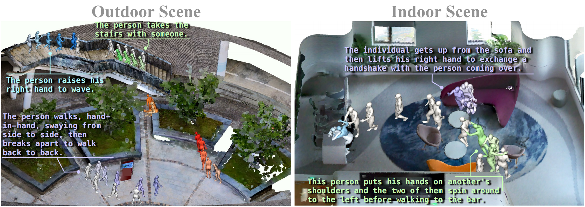

# LaserHuman: Language-guided Scene-aware Human Motion Generation in Free Environment.

<!-- ### [Project Page](https://4dvlab.github.io/project_page/laserhuman.html) | [Arxiv](https://arxiv.org/pdf/2403.13307.pdf) -->

<p align="center">
  <a href='https://arxiv.org/pdf/2403.13307.pdf'>
    </a>
  <a href='https://arxiv.org/pdf/2403.13307.pdf'>
    
  </a>
  <a href='https://4dvlab.github.io/project_page/hucenlife.html'>
  </a>
  <!-- <a href='https://youtu.be/0a0ZYJgzdWE'>
  </a> -->
  <!-- <a href="" target='_blank'>
    
  </a> -->
</p>
<p float="center">
  
</p>

<!-- <p float="center">
  
</p> -->


Language-guided scene-aware human motion generation has great significance for entertainment and robotics. In response to the limitations of existing datasets, we introduce LaserHuman, a pioneer- ing dataset engineered to revolutionize Scene-Text-to-Motion research. LaserHuman stands out with its inclusion of genuine human motions within 3D environments, unbounded free-form natural language descrip- tions, a blend of indoor and outdoor scenarios, and dynamic, ever-changing scenes. Diverse modalities of capture data and rich annotations present great opportunities for the research of conditional motion generation,and can also facilitate the development of real-life applications. More- over, to generate semantically consistent and physically plausible human motions, we propose a multi-conditional diffusion model, which is simple but effective, achieving state-of-the-art performance on existing datasets.

## 💻 Train your own models
1. Prepare the datasets
<p float="center">
  
</p>

2. Ready to train
   
...Coming soon.


## License
All datasets are published under the [Creative Commons Attribution-NonCommercial-ShareAlike](https://creativecommons.org/licenses/by-nc-sa/4.0/).
This means that you must attribute the work in the manner specified by the authors, you may not use this work for commercial purposes and if you alter, transform, or build upon this work, you may distribute the resulting work only under the same license. 

## Citation
 ```
@misc{cong2024laserhuman,
      title={LaserHuman: Language-guided Scene-aware Human Motion Generation in Free Environment}, 
      author={Peishan Cong and Ziyi Wang and Zhiyang Dou and Yiming Ren and Wei Yin and Kai Cheng and Yujing Sun and Xiaoxiao Long and Xinge Zhu and Yuexin Ma},
      year={2024},
      eprint={2403.13307},
      archivePrefix={arXiv},
      primaryClass={cs.CV}
}
 ```

